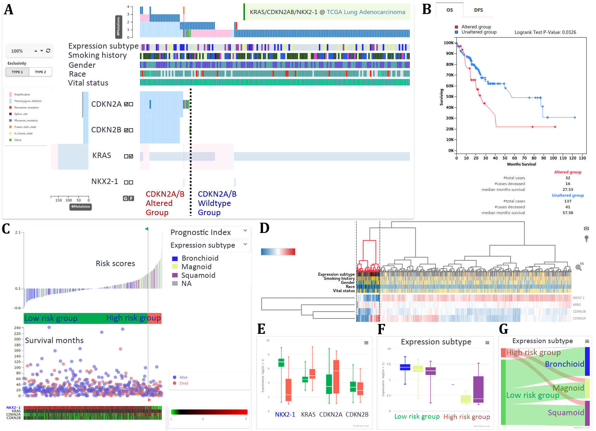

# CaPSSA

A [re-frame](https://github.com/Day8/re-frame) application designed to ... well, visit http://capssa.ewha.ac.kr.



## Development Mode

### Run application:

```
lein clean
lein compile
lein repl
```

Figwheel will automatically push cljs changes to the browser.

Wait a bit, then browse to [http://localhost:3449](http://localhost:3449).

## Production Build

```
lein clean
lein cljsbuild once min
lein compile
lein uberjar
```

That should compile the Clojure and ClojureScript code first, and then create the standalone jar (CaPSSA.jar).

When you run the jar you can set the port the ring server will use by setting the environment variable PORT.
If it's not set, it will run on port 8080 by default.
